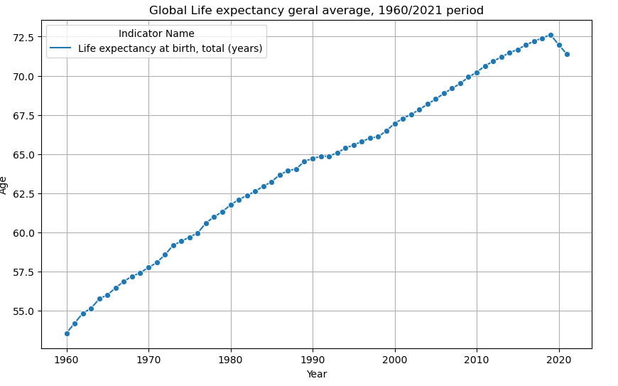
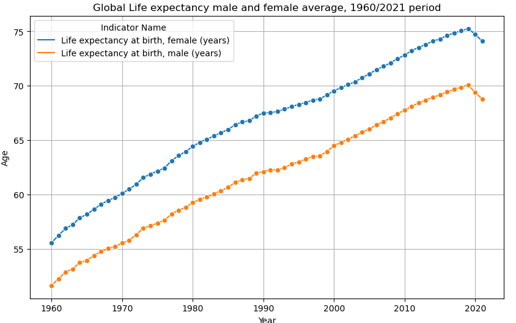
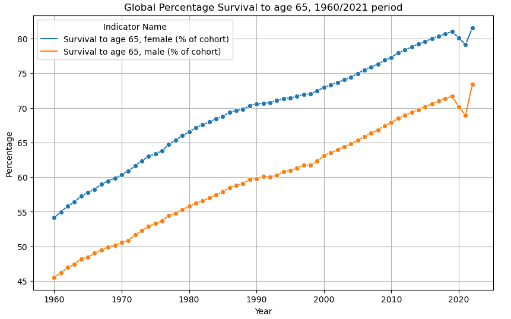
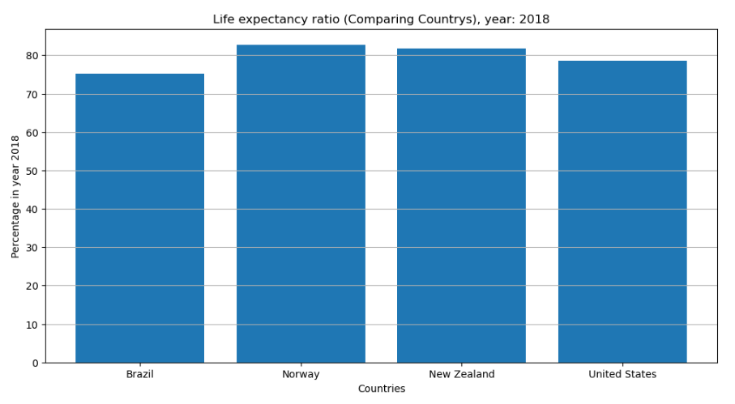
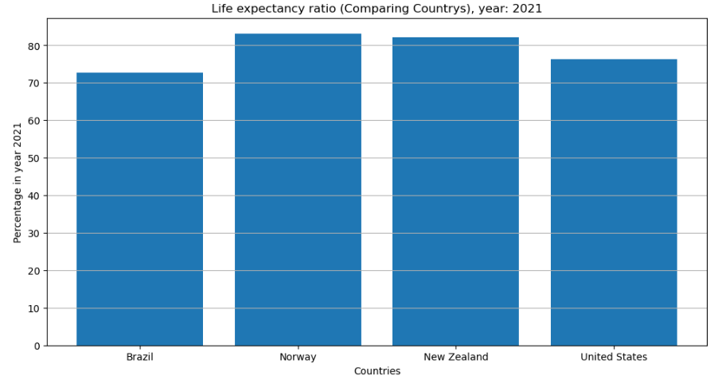
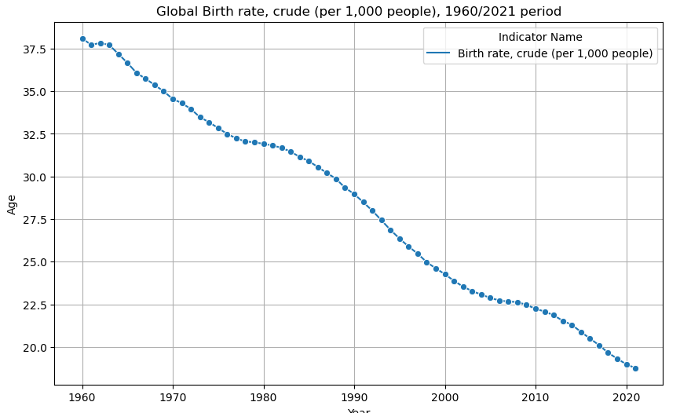
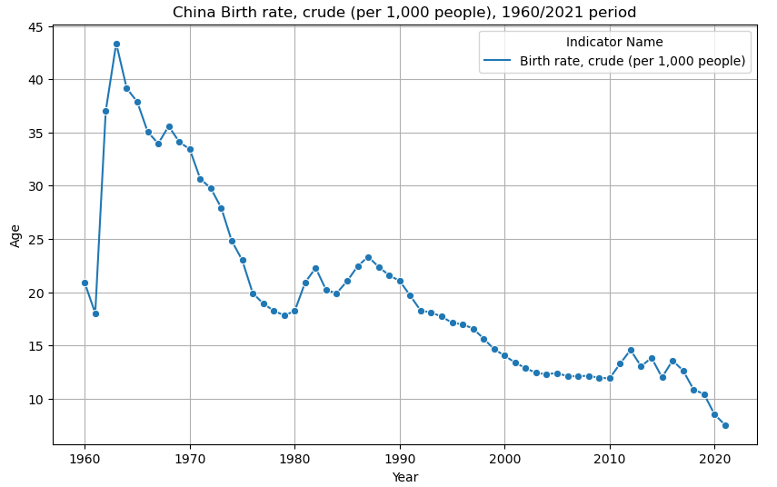
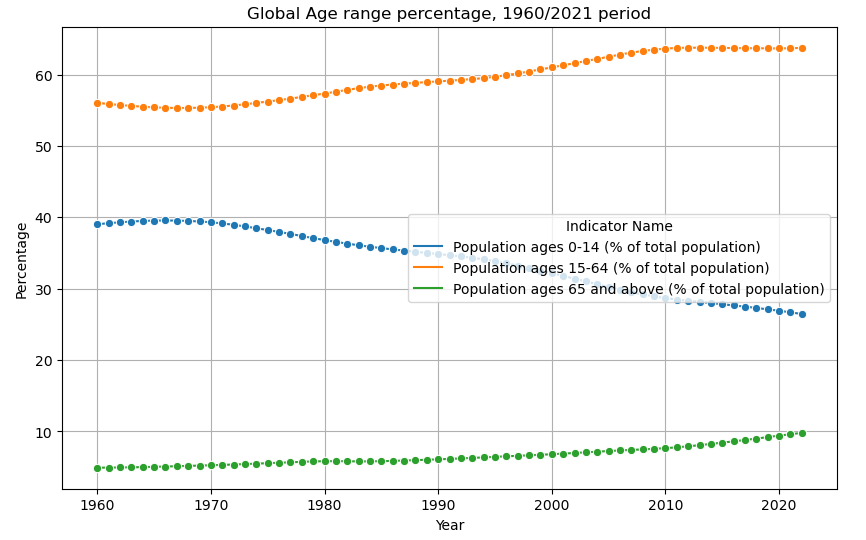
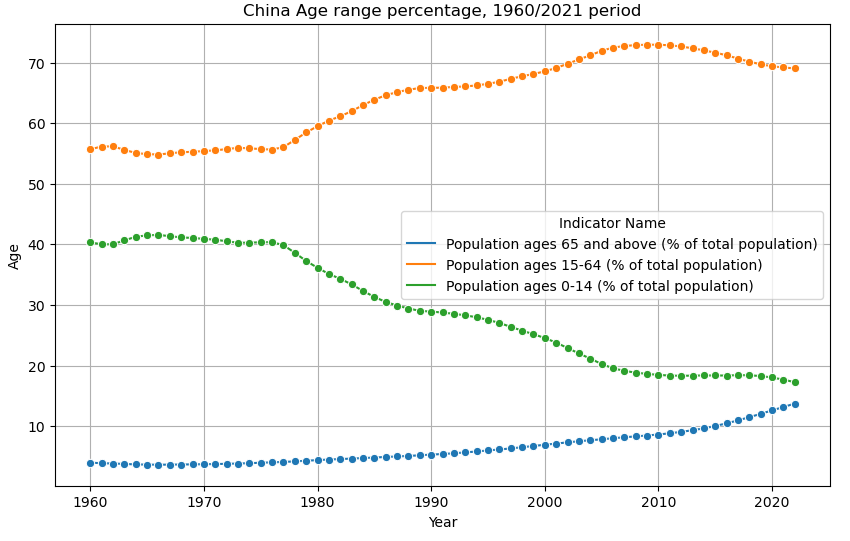

# Global_Life_Expectancy

# Project Overview
This project analyzes global life expectancy data from 1960 to 2022. The analysis is presented through a series of visualizations created using Jupyter Notebooks. The primary focus is on understanding trends in life expectancy, survival rates, birth rates, and population demographics over this period.

# Features
The notebook provides the following key analyses:

# Global Life Expectancy Trends:

After viewing, in general, the global panorama of life expectancy, what immediately catches our attention is the first decline recorded after 2020, which comes after a constant increase, which leads us to think that it is probably due to the COVID-19 pandemic.

# Comparison of Life Expectancy by Gender:

Compares the average life expectancy of men and women over the years.
Both averages have increased together over time, but the female life expectancy has consistently been higher than the male, indicating a potentially greater focus on health among women.

# Survival Rate Analysis:

Examines the percentage of men and women surviving to age 65.
Notable decline observed in 2020 and 2021, further confirming the global impact of the pandemic mainly over older people.
It is also possible to notice a considerable increase from 2022 onwards, indicating a possible return to normality after the pandemic.

How noticeable the impact of the pandemic was in the first analyses, it becomes productive to go deeper and includes two additional graphs comparing four countries:

Two countries with exemplary pandemic response policies (New Zealand and Norway).
Two countries with poor pandemic response (United States and Brazil).

It is possible to notice that the countries with effective policies, life expectancy remained relatively stable post-pandemic (comparing 2018 and 2021).  In otherway, countries with poor response showed a significant decline, highlighting the consequences of inadequate support.

# Global Birth Rate Trends:

Examines the global birth rate and compares it with countries that have birth control policies.

Both rates have been declining over time, but the decline is more pronounced in countries with such policies (e.g., China).

# Population Age Group Distribution:

Compares the percentage of the population in different age groups (0-14, 15-64, 65+).

Shows a general trend of population aging, with the younger age group declining in percentage while the older groups are increasing. This is attributed to the global decline in birth rates, as shown in the birth rate graph, and advancements in medicine leading to longer lifespans.

# Detailed Analysis on China:

Further analysis related to point 4, highlighting the more significant aging population in a country like China, which has implemented strict birth control policies.

# Conclusion

The comprehensive analysis of global life expectancy data from 1960 to 2022 provides critical insights into various demographic trends and their underlying causes. The observed decline in life expectancy starting in 2020 underscores the profound impact of the COVID-19 pandemic on global health. Gender-based comparisons reveal a consistent pattern of higher life expectancy for women, potentially reflecting differences in health behaviors and access to care. The sharp decline in survival rates to age 65 during the pandemic years further emphasizes the crisis's severity, with stark contrasts between countries based on their pandemic response policies. The examination of birth rates highlights the significant effect of birth control policies, particularly in countries like China, on demographic changes. Additionally, the aging population trend is evident from the shifting age group distributions, driven by declining birth rates and advancements in healthcare. This analysis not only illuminates past and present demographic shifts but also underscores the importance of effective health policies and interventions in shaping future global health outcomes. Through these detailed visualizations and comparisons, this project aims to provide a valuable resource for policymakers, researchers, and anyone interested in understanding the factors influencing life expectancy and population dynamics worldwide.

